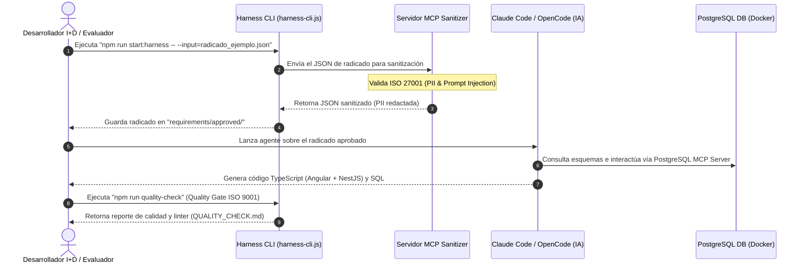

# HARNESS_DESIGN.md - Especificación Técnica y Arquitectura (I+D & ISO 27001)

Este documento especifica el diseño conceptual y la arquitectura del arnés de automatización e ingesta de requerimientos para **Informática y Tributos S.A.S.**

## 1. Arquitectura de Flujo de Transformación
El Harness se diseña bajo un patrón desacoplado que separa la validación del entorno de la ejecución de lógica inteligente (IA).

## 2. Estrategia de Prompting, Skills y Reglas

### Skills Locales del Repositorio
*   **Claude Code:** Configurado mediante el archivo `.claude/skills/generate-tributo.json`. El agente carga la habilidad `generate-tributo` al inicializarse en el proyecto.
*   **OpenCode:** Guiado mediante las reglas locales de `.opencode/rules/rules.md`.
*   **Reglas de Frontend (Angular):** Componentes standalone obligatorios, control de estado mediante Signals (`signal`, `computed`) y uso de `ReactiveFormsModule` para formularios reactivos que garanticen la integridad de los datos.
*   **Reglas de Backend (NestJS):** Lógica modular en carpetas `apps/nest-app/src/modules/[tramite]/`, DTOs obligatorios con decoradores de validación `class-validator`, y control de base de datos a través de TypeORM.

## 3. Seguridad y Privacidad de Datos (ISO 27001)
*   **Sanitización de Datos de Identificación Personal (PII):** El servidor MCP detecta automáticamente patrones de correo electrónico (`[a-zA-Z0-9._%+-]+@[a-zA-Z0-9.-]+\.[a-zA-Z]{2,}`) y números de teléfono. Toda la PII se reemplaza por tokens (`[EMAIL_REDACTED]`, `[PHONE_REDACTED]`) antes de ser enviada al agente, evitando fugas de información.
*   **Prevención de Prompt Injection:** El Harness analiza los textos de entrada para buscar patrones comunes de inyección (e.g., "ignore previous instructions"). Si se detecta un patrón, el proceso de ingesta se detiene inmediatamente con un código de salida `1` de error crítico.
