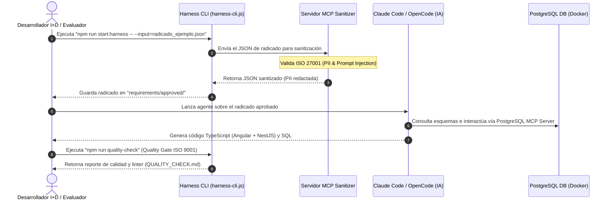
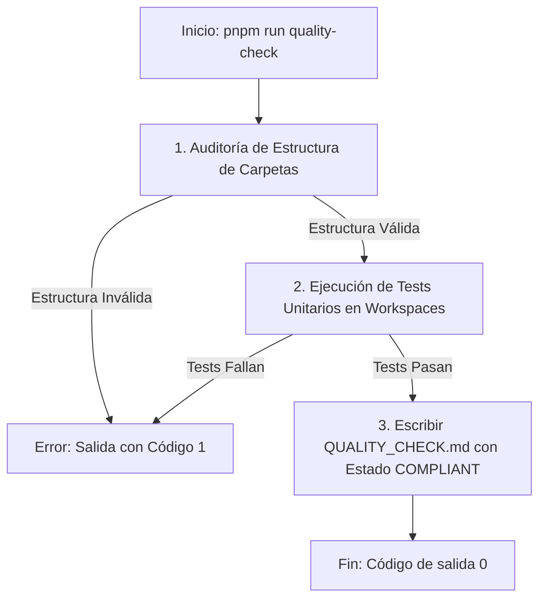

# HARNESS_DESIGN.md - Especificación Técnica y Arquitectura (I+D & ISO 27001)

Este documento especifica el diseño conceptual y la arquitectura del arnés de automatización e ingesta de requerimientos para **Informática y Tributos S.A.S.**

## 1. Arquitectura de Flujo de Transformación
El Harness se diseña bajo un patrón desacoplado que separa la validación del entorno de la ejecución de lógica inteligente (IA).



## 2. Estrategia de Prompting, Skills y Reglas

### Skills Locales del Repositorio
*   **Claude Code:** Configurado mediante el archivo `.claude/skills/generate-tributo.json`. El agente carga la habilidad `generate-tributo` al inicializarse en el proyecto.
*   **OpenCode:** Guiado mediante las reglas locales de `.opencode/rules/rules.md`.
*   **Reglas de Frontend (Angular):** Componentes standalone obligatorios, control de estado mediante Signals (`signal`, `computed`) y uso de `ReactiveFormsModule` para formularios reactivos que garanticen la integridad de los datos.
*   **Reglas de Backend (NestJS):** Lógica modular en carpetas `apps/nest-app/src/modules/[tramite]/`, DTOs obligatorios con decoradores de validación `class-validator`, y control de base de datos a través de TypeORM.

## 3. Seguridad y Privacidad de Datos (ISO 27001)
*   **Sanitización de Datos de Identificación Personal (PII):** El servidor MCP detecta automáticamente patrones de correo electrónico (`[a-zA-Z0-9._%+-]+@[a-zA-Z0-9.-]+\.[a-zA-Z]{2,}`) y números de teléfono. Toda la PII se reemplaza por tokens (`[EMAIL_REDACTED]`, `[PHONE_REDACTED]`) antes de ser enviada al agente, evitando fugas de información.
*   **Prevención de Prompt Injection:** El Harness analiza los textos de entrada para buscar patrones comunes de inyección (e.g., "ignore previous instructions"). Si se detecta un patrón, el proceso de ingesta se detiene inmediatamente con un código de salida `1` de error crítico.

## 4. Diagramas de Arquitectura y Flujo Detallados

### 4.1 Arquitectura del Sistema e Integración de MCPs
El siguiente diagrama muestra la relación entre el Frontend (Angular), Backend (NestJS), la Base de Datos y los servidores MCP locales que consumen los agentes de IA.

```mermaid
graph TD
    subgraph Frontend (Angular Standalone)
        F_Form[FormularioRadicacionComponent] -->|Reactive Forms| F_Service[DeclaracionesIcaService]
        F_Table[TablaConsultaComponent] -->|Signals| F_Service
    end

    subgraph Backend (NestJS)
        B_Controller[DeclaracionRetencionIcaController] -->|DTO Validation| B_Service[DeclaracionRetencionIcaService]
        B_Service -->|TypeORM| B_Entity[DeclaracionRetencionIcaEntity]
    end

    subgraph Database (Docker)
        DB_Postgres[(PostgreSQL)]
    end

    subgraph Entorno de Automatización (Harness)
        H_CLI[Harness CLI] -->|Ingiere radicado| H_MCP_San[security-sanitizer MCP]
        Agent_CLI[Agente de IA] -->|Consulta esquema| H_MCP_DB[postgres-db MCP]
        Agent_CLI -->|Escribe| Frontend
        Agent_CLI -->|Escribe| Backend
    end

    F_Service -->|HTTP REST API| B_Controller
    B_Entity -->|Lee/Escribe| DB_Postgres
    H_MCP_DB -->|Interroga DB| DB_Postgres
```

### 4.2 Flujo Detallado de Control de Calidad (Quality Gate)
El Quality Gate asegura de forma estricta (ISO 9001) que el código autogenerado cumple con la estructura y la suite de pruebas unitarias antes de autorizar el empaquetado o despliegue.



## 5. Diseño del Esquema de Base de Datos PostgreSQL
El esquema relacional implementado mapea el radicado tributario (ICA) para persistencia transaccional y auditoría:

```sql
-- Tabla Principal de Declaraciones de Retención de ICA
CREATE TABLE declaraciones_ica (
    id UUID PRIMARY KEY DEFAULT gen_random_uuid(),
    nit_contribuyente VARCHAR(20) NOT NULL,
    periodo_grabable VARCHAR(6) NOT NULL, -- Formato: YYYYMM
    monto_retenido NUMERIC(15,2) NOT NULL CHECK (monto_retenido > 0),
    estado VARCHAR(15) DEFAULT 'PENDIENTE' CHECK (estado IN ('PENDIENTE', 'APROBADO', 'RECHAZADO')),
    created_at TIMESTAMP DEFAULT CURRENT_TIMESTAMP
);
```

