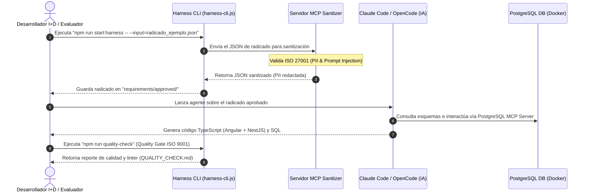
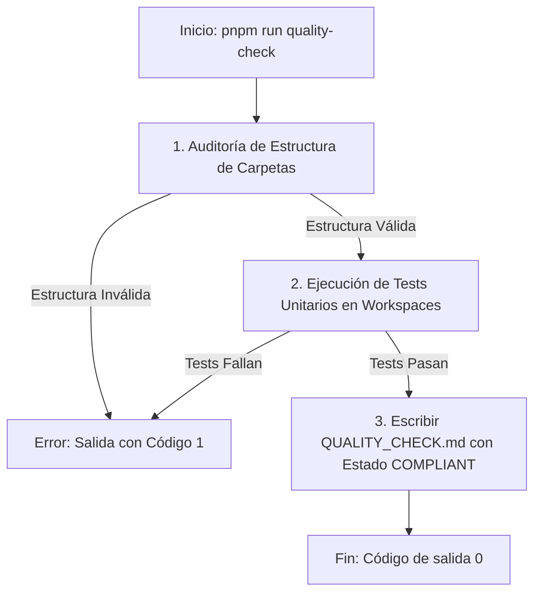
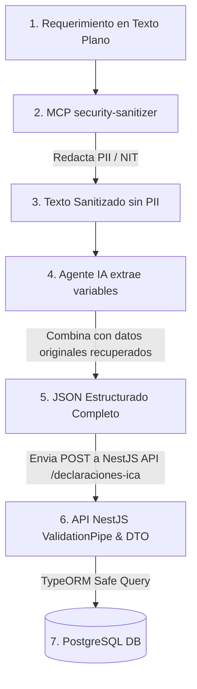

# HARNESS_DESIGN.md - Especificación Técnica y Arquitectura (I+D & ISO 27001)

Este documento especifica el diseño conceptual y la arquitectura del arnés de automatización e ingesta de requerimientos para **Informática y Tributos S.A.S.**

## 1. Arquitectura de Flujo de Transformación
El Harness se diseña bajo un patrón desacoplado que separa la validación del entorno de la ejecución de lógica inteligente (IA).



## 2. Estrategia de Prompting, Skills y Reglas

### Skills Locales del Repositorio
*   **Claude Code:** Configurado mediante el archivo `.claude/skills/generate-tributo.json`. El agente carga la habilidad `generate-tributo` al inicializarse en el proyecto.
*   **OpenCode:** Guiado mediante las reglas locales de `.opencode/rules/rules.md`.
*   **Reglas de Frontend (Angular):** Componentes standalone obligatorios, control de estado mediante Signals (`signal`, `computed`) y uso de `ReactiveFormsModule` para formularios reactivos que garanticen la integridad de los datos.
*   **Reglas de Backend (NestJS):** Lógica modular en carpetas `apps/nest-app/src/modules/[tramite]/`, DTOs obligatorios con decoradores de validación `class-validator`, y control de base de datos a través de TypeORM.

## 3. Seguridad y Privacidad de Datos (ISO 27001)
*   **Sanitización de Datos de Identificación Personal (PII):** El servidor MCP detecta automáticamente patrones de correo electrónico (`[a-zA-Z0-9._%+-]+@[a-zA-Z0-9.-]+\.[a-zA-Z]{2,}`) y números de teléfono. Toda la PII se reemplaza por tokens (`[EMAIL_REDACTED]`, `[PHONE_REDACTED]`) antes de ser enviada al agente, evitando fugas de información.
*   **Prevención de Prompt Injection:** El Harness analiza los textos de entrada para buscar patrones comunes de inyección (e.g., "ignore previous instructions"). Si se detecta un patrón, el proceso de ingesta se detiene inmediatamente con un código de salida `1` de error crítico.

## 4. Diagramas de Arquitectura y Flujo Detallados

### 4.1 Arquitectura del Sistema e Integración de MCPs
El siguiente diagrama muestra la relación entre el Frontend (Angular), Backend (NestJS), la Base de Datos y los servidores MCP locales que consumen los agentes de IA.

```mermaid
graph TD
    subgraph Frontend (Angular Standalone)
        F_Form[FormularioRadicacionComponent] -->|Reactive Forms| F_Service[DeclaracionesIcaService]
        F_Table[TablaConsultaComponent] -->|Signals| F_Service
    end

    subgraph Backend (NestJS)
        B_Controller[DeclaracionRetencionIcaController] -->|DTO Validation| B_Service[DeclaracionRetencionIcaService]
        B_Service -->|TypeORM| B_Entity[DeclaracionRetencionIcaEntity]
    end

    subgraph Database (Docker)
        DB_Postgres[(PostgreSQL)]
    end

    subgraph Entorno de Automatización (Harness)
        H_CLI[Harness CLI] -->|Ingiere radicado| H_MCP_San[security-sanitizer MCP]
        Agent_CLI[Agente de IA] -->|Consulta esquema| H_MCP_DB[postgres-db MCP]
        Agent_CLI -->|Escribe| Frontend
        Agent_CLI -->|Escribe| Backend
    end

    F_Service -->|HTTP REST API| B_Controller
    B_Entity -->|Lee/Escribe| DB_Postgres
    H_MCP_DB -->|Interroga DB| DB_Postgres
```

### 4.2 Flujo Detallado de Control de Calidad (Quality Gate)
El Quality Gate asegura de forma estricta (ISO 9001) que el código autogenerado cumple con la estructura y la suite de pruebas unitarias antes de autorizar el empaquetado o despliegue.



## 5. Diseño del Esquema de Base de Datos PostgreSQL
El esquema relacional implementado mapea el radicado tributario (ICA) para persistencia transaccional y auditoría:

```sql
-- Tabla Principal de Declaraciones de Retención de ICA
CREATE TABLE declaraciones_ica (
    id UUID PRIMARY KEY DEFAULT gen_random_uuid(),
    nit_contribuyente VARCHAR(20) NOT NULL,
    periodo_grabable VARCHAR(6) NOT NULL, -- Formato: YYYYMM
    monto_retenido NUMERIC(15,2) NOT NULL CHECK (monto_retenido > 0),
    estado VARCHAR(15) DEFAULT 'PENDIENTE' CHECK (estado IN ('PENDIENTE', 'APROBADO', 'RECHAZADO')),
    created_at TIMESTAMP DEFAULT CURRENT_TIMESTAMP
);
```

## 6. Protocolo de Captura de Informacion y Persistencia Segura (ISO 27001)

Para dar cumplimiento estricto a las normas de seguridad de informacion **ISO 27001** y prevenir alteraciones no autorizadas en los entornos productivos de la organizacion, el Harness implementa el siguiente protocolo de captura y persistencia:

### 6.1 Principio de Segregacion de Canales y Datos
El flujo separa categoricamente el procesamiento de lenguaje natural no estructurado del canal transaccional de escritura:

1.  **Canal de Analisis (Sanitizacion por MCP):** 
    Toda solicitud recibida en formato de texto libre es enviada al servidor MCP `security-sanitizer`. Este modulo redacta en tiempo real correos electronicos, telefonos y numeros de identificacion fiscal (NIT colombianos como `830.092.110-3` enmascarado como `[NIT_REDACTED]`), previniendo que cualquier IA de generacion de codigo o documentacion almacene o aprenda de datos sensibles en su base de conocimiento.
2.  **Canal de Escritura (Persistencia via API):**
    Queda terminantemente prohibido que los agentes de IA (Claude Code, OpenCode, Gemini) realicen conexiones de escritura directa sobre las tablas fisicas de PostgreSQL.
    - El MCP `postgres-db` esta configurado con permisos exclusivos de solo lectura (`read-only transaction`).
    - Toda operacion de registro, actualizacion o borrado debe realizarse invocando el API REST de la aplicacion (NestJS) expuesto de forma controlada en el puerto `3000`.

### 6.2 Flujo Secuencial del Protocolo (Paso a Paso)



1.  **Captura por MCP:** El texto plano se analiza mediante la herramienta `sanitize_payload` del MCP, que enmascara los datos sensibles reemplazandolos con tokens redactados (`[EMAIL_REDACTED]`, `[PHONE_REDACTED]`, `[NIT_REDACTED]`).
2.  **Mapeo e Integracion de Falsos Positivos:** El Agente extrae las variables del radicado. Si un valor numerico de negocio (como el monto monetario) es detectado como falso positivo de PII por el sanitizador, el agente lo identifica, restaura el valor original y documenta la trazabilidad en la metadata.
3.  **Persistencia Controlada via API:** Los datos estructurados resultantes (NIT, Periodo, Monto y los contactos sanitizados) se envian mediante una peticion POST HTTP a la aplicacion NestJS.
4.  **Validacion y Guardado:** El DTO de NestJS valida los tipos y rangos (`class-validator`), audita la transaccion e inserta de forma segura el registro en PostgreSQL.


